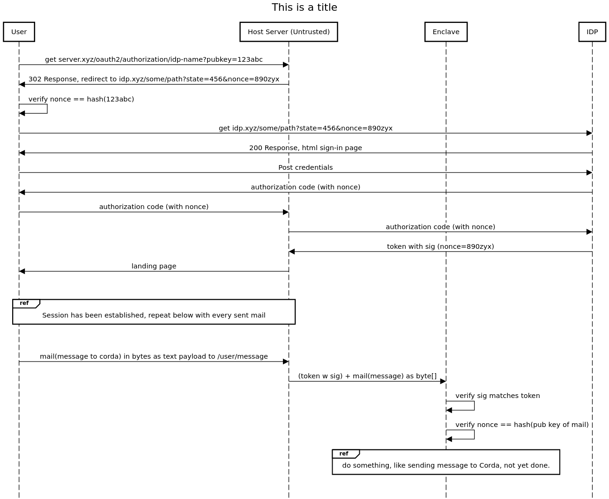

# OpenID Connect via Enclave
The easiest way to understand the context for, and therefore design decisions in this project is to consider
the specific use case.
This was developed for Parsedata's V2G project, which required the communication between a user and a Corda node
over a 5G SDN-NFV function (through AWS Wavelength, for instance). 
The authentication could happen via OAuth2/OpenID Connect with a trusted OP, and the RP was to be the Wavelength.
Roughly speaking, the person would be authenticated via the trusted OP over Wavelength, initiating an OAuth
session with the server running on Wavelength, from which requests could be forwarded or translated and then forwarded
in a new form to the appropriate Corda node.

The problem was that the Wavelength machines were multi-tenanted, meaning that there was no guarantee
as to the security of data and software in-memory. This meant that there could be all sorts of dangers
related to the authentication of the user being tampered with/ignored, or even replays or forged messages
sent to the Corda node (without the user having actually initiated something!)

We decided that we could address this with a Secure Enclave, handled by R3 Conclave.
A Secure Enclave is very limited in terms of resources (both memory and secure device access),
so we could not run the entire server inside the enclave.
Instead, the application would be split up between a trusted and untrusted part, where the two handle different things.

Conclave provides a Mail protocol for end-to-end authenticated, unreplayable encryption between a "client"
and an enclave (end-to-end in the sense that, despite it going through the host, the host cannot decrypt, 
forge, or replay Mails). We could use this to ensure that all requests to interact with the blockchain
go through the Enclave, which then writes and encrypts (as Mail) an appropriate message to send to a Corda node
(or a webserver that has an RPC connection with said node). The Corda node can verify the validity of this
node by checking a remote attestation, and the public key from that remote attestation 
(the private key component of which is hidden inside of the hardware) is used to sign Mails.
This means that it is possible to have all user requests go through the enclave, 
which performs trusted verification of their validity before sending Mail to the appropriate Corda node.

As to the authentication, most of the process is performed inside the `:host`, by a Spring server in the untrusted world.
An authorization code flow is performed, and the established OAuth session is maintained by this Spring server.
With every request, the Spring server passes the request and associated OpenID Connect token to the enclave,
which verifies the validity of the OpenID Connect token before encrypting and sending a message to a Corda node.

However, you can see here that there would be nothing stopping the untrusted host from simply injecting or replaying
user requests to the enclave with its valid token, thereby "hijacking" the OAuth session.
Signing in would be akin to giving away car keys (the token passed to the enclave) to the untrusted host,
which it can use as it likes. This is very much NOT in the spirit of OAuth!

To prevent this, we establish the same encrypted Mail communication between the user and the enclave as we do
between the enclave and the Corda node. However, *this also* presents a problem: the enclave cannot know that the
supposed user's public key actually came from the user. In fact, the untrusted server could inject its own key!

To mitigate this, the hash of the user's public key is tied to the user's authentication process.
There is a `nonce` field in the OpenID Connect specification, which is used to prevent CSRF attacks.
In the specification, whatever value that is passed as the `nonce` in the authentication request via the user agent
is returned by the OP in both the authorization code and the OpenID Connect token.
We *slightly* abuse it to tie the user's identity to an ephemeral key pair (which is used to negotiate
a symmetric key via ECDH as part of the Mail protocol). 
Once it's in the OIDC token, the host cannot change the nonce value: it is part of the signed JWT.
Thus, the enclave can simply:
* verify that the signature on the OIDC token that it is passed is valid (the token hasn't been tampered with by the host)
* verify that the `nonce` value in the OIDC token is indeed the hash of the public key used to encrypt the 
  message it has been sent
  
The process for this "tying" is as follows:
* The user hits the host's `/oauth2/authorization/mock-oidc?pubkey=abcd` endpoint
  (where `mock-oidc` is replaced by the OP name) where the value of `pubkey` (instead of `abcd`) 
  is the public key of the ephemeral key pair
* The host returns a 302 redirect to the OP webpage, where the `nonce` value is the SHA256 hash of `pubkey`
  * The user verifies that this `nonce` really is the hash of their public key before following the redirect. 
    If not, the user doesn't follow the redirect!
* The user signs in to the OP etc, is given a redirect back to the untrusted host
  * The redirect contains an authorization code, which has the same `nonce` value
* The host uses the authorization code to retrieve an OIDC token from the OP
  * The token contains the same `nonce` value

Now, a session has been established! Notice that the enclave has not been involved until this point.
Within this session, a user can send encrypted Mail to the enclave.
First, the user retrieves the remote attestation of the enclave by visiting the `/attestation`
endpoint exposed by the untrusted host. The public key from this attestation can be used to generate
the symmetric key used for encrypting the Mail.

Each message within an OAuth session would go through this flow:
* User sends encrypted, hex-encoded message as plain text body of http GET request to the `/user/message`
  endpoint exposed by the host
* The host hex-decodes the message into an encrypted byte array, and sends that to the enclave
  along with the String Base64-encoded OpenID Connect token corresponding to the user's OAuth session to the enclave
* The enclave parses the token and verifies its internal validity (the validity of the signature on it)
* The enclave verifies that the `nonce` is the hash of the public key used to encrypt this Mail
* The enclave decrypts and interprets the Mail, doing something with it 
  and sending some mail to some Corda node (this is not yet done)
  
All of this is demonstrated in this diagram (mostly focused on the authentication step, above)
